# **Learn MySQL Database Programming**

# 1 Introduction to Relational Database Management Systems (RDMS)

## 1.1 Understanding SQL

SQL (Structured Query Language) is used for:
- Querying data
- Manipulating data
- Defining structures of databases

SQL subdivisions:
- Data definition language (DDL): create, alter, drop, truncate
- Data manipulation language (DML): select, insert, update, delete
- Data control language (DCL): grant, revoke, commit, rollback

SQL elements:

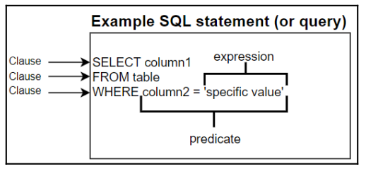

## 1.2 Understanding Databases

- Tables: In an RDMS, objects called tables store data. Tables are a collection of related data stored in columns and rows.
- Fields: A field is an intersection of a row and a column. This field could be any type of data.
- Records or rows: A row contains values in a horizontal division of data.
- Columns: A column contains values in a vertical division of data.

## 1.3 Understanding Data Integrity

- Data intergrity: The consistency and accuracy of the data. In RDMS, keys enforce data integrity. A key is user-defined and forces values in a table to conform to a specified standard, allowing only certain kinds of values to be in the database.
- Types of integrity:
  - Entity integrity: Ensure that each row in a table is identifiably unique
    - Unique constraints: Ensure that all values in a column or columns are different from each other.
    - Not null constraints: ensure that all values in a column are not null, you use a not null constraint. This type of key can be applied to any data type and is used to avoid missing data.
    - Primary key: ensure that all values in a column are not null and unique. You can only have one primary key per table. You can also create a primary key on multiple columns. This is considered a composite key. In this case, the composite key would have to be unique for each row.
  - Referential integrity: consistency and accuracy between tables that can be linked together. By having a primary key on the parent table and a foreign key on the child table, you achieve referential integrity. If you don't set up referential integrity, you wind up with orphaned records.  
    - Types of foreign key:
      - One-to-one: when one table has just one corresponding row in another table.
      - One-to-many: when one table has none, one, or many corresponding rows in another table. 
      - Many-to-many: when many rows in one table correspond to many rows in another table.
  - Domain integrity: ensure that data values follow defined rules for formatting, range, and value using check and default constraints.

## 1.4 Database Normalization

Database normalization is the process of putting your raw data into tables using rules to avoid redundant data, optimize database performance, and ensure data integrity.

### 1.4.1 The First Normal Form (1NF)

The primary reason to implement 1NF is to eliminate repeating groups. This step will ensure that you are doing the following:
- Defining data, columns, and data types and putting related data into columns.
- Eliminating repeating groups of data.
  - Not have repeating columns
  - Not having multiple values in the same field
  - No exact duplicate rows
- Creating a primary key for each table

### 1.4.2 The Second Normal Form (2NF)

You will need to complete 1NF before beginning this step. The primary reason to implement 2NF is to narrow tables down to a  single purpose, which makes it easier to use and design tables. This step will ensure that you do the following:
- Meet the requirements of 1NF
- Remove partial dependencies

### 1.4.3 The Third Normal Form (3NF)

You will need to complete 2NF before beginning this step. The primary reason to implement 3NF is to ensure that your tables  aren't created so that dependencies between columns may cause inconsistency. This step will ensure that you are doing the following:
- Meeting the requirements of 2NF
- No attributes depend on other non-key attributes

# 2 Understanding Data Types

- String: can hold plain text and binary data.
  - char: It is a fixed-length string, which can contain letters, numbers, and special characters. This field can range from 0 to 255.
  - varchar: It is a variable-length string, which can contain letters, numbers, and special characters. This field can range from 0 to 65535.
  - binary: like CHAR, but stores byte strings instead of character strings. This field can range from 0 to 255.
  - varbinary: like VARCHAR, but stores binary byte data instead of character data. This field can range from 0 to 65535.
  - blob: stands for binary large objects, and treats values like they are binary strings. They can hold a variable amount of data.
  - text: stored in a text field and treated as character strings instead of binary strings. They can hold a variable amount of data.
  - enum: stands for an enumerated list. With ENUM(val1, val2, val3, ...), you put your values in place of val1, val2, val3, and so on with values separated by commas. You can have up to 65,535 values in an ENUM list.
  - set: As with ENUM, SET(val1, val2, val3, ...) allows you to put your values in place of val1, val2, val3, and so on. However, this string object can have zero or more values chosen from a list of specified values. You can have up to 64 values in a SET list. 
- Numeric
  - bit: stores binary values. The syntax is BIT(size), where size is the number in bits a value can have. The value range is 1 to 64.
  - int: value can range from -2147483648 to 2147483647. With INT, there are different varieties from which to choose. They are BIGINT, SMALLINT, MEDIUMINT, INT, and TINYINT.
  - float: To use the FLOAT data type, you use FLOAT(size, p), where size is the total number of digits, and p is the number of digits after the decimal place. FLOAT is accurate up to approximately 7 decimal places.
  - double: To use the DOUBLE data type, you use DOUBLE(size, d), where size is the total number of digits, and d is the number of digits after the decimal place. DOUBLE is accurate up to approximately 14 decimal places.
  - decimal: exact fixed-point number. The maximum size is 65, and the maximum d is 30. If size and d aren't specified, the default size is 10, and the default d is 0. DECIMAL is suitable for financial data because it more accurately represents all numbers, whereas FLOAT and DOUBLE aren't as accurate.
- Date and time
  - date: hold a date in the format of YYYY-MM-DD. The range is from '1000-01-01' to '9999-12-31'.
  - time: time values in the format of hh:mm:ss. The range is from '-838:59:59' to '838:59:59'.
  - datetime: hold a combination of date and time in the format of YYYY-MM-DD hh:mm:ss. The range is from '1000-01-01 00:00:00' to '9999-12-31 23:59:59'. 
  - timestamp: hold values that contain both date and time parts. This has a range of '1970-01-01 00:00:00' UTC to '2038-01-19 03:14:07' UTC
  - year: hold the values of a year in four-digit format. The range is 1901 to 2155, and 0000.

# 3 Indexing and Data Integrity

Whenever you create a primary key, unique constraint, or foreign key, MySQL stores them as indexes. 

## 3.1 Types of Indexes

- Clustered: Clustered indexes store the data in order, so whatever columns you choose in a clustered index, that's the way the data will be sorted in a table. The data is stored physically on disk in the order of the clustered index. A clustered index can be viewed as a tree built on top of a table. The columns (key) that you place in the clustered index determines the order of the rows in the table.
- Non-clustered: Nonclustered indexes don't sort the data. They instead use pointers to the physical data to quickly locate the data when the index is used to query data. You can have multiple nonclustered indexes on a table, but you need to be careful not to create too few or too many because your queries can be slowed down either way. 

## 3.2 Indexing and Performance

- If your table has no index, then the query will need to scan through the entire table to find the data in much the same way that you would have to scan through an entire book if it didn't have an index in the back. 
- Locking isn't bad in and of itself, but it becomes an issue when different queries interfere with each other and cause blocking. Blocking happens when more than one query is trying to read or write the same data. If you create indexes and use them properly with your queries, then you will have less blocking and deadlocking to deal with because the index will allow you to query data more quickly.
- The main way that indexes can speed up a query is by using the columns in the index when joining tables, when filtering results, and when ordering results.

Important notes:
- Indexing doesn't speed up everything that happens in a database table. It won't speed up writes (the inserting, updating, and deleting of data). It only speeds up reading (querying data from the database).
- The order of the columns in indexes matters. If you need to sort using yearid most of the time, then you should have an index that has yearid as the first column in the index.
- Indexes can take up a lot of storage, especially non-clustered indexes.
- When adding columns, be careful that you don't have too many columns in your index. 
- Indexing columns that contain a lot of non-unique values may not provide much performance improvement.

# 4 Querying a Single Table

Order of SQL keywords in a SQL statement

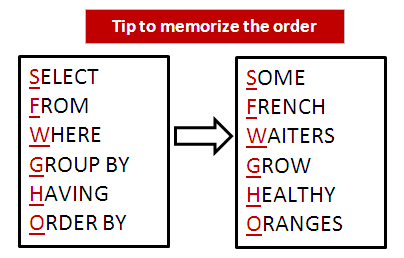

## 4.1 Select

```sql
select column_name from table_name;

select column_name1, column_name2, column_name3 from table_name;

select * from table_name;

select column_name as alias_name from table_name;

select distinct column_name from table_name;

select column_name from table_name limit ex_500;

select column_name from table_name limit get_ex_500 offset from_ex_1000;

```

## 4.2 Where

```sql
select column_name from table_name where some_conditions;

select column_name from table_name where (some_conditions and/or some_conditions);

select column_name from table_name where this in (this, that, others);

select column_name from table_name where this between here and there;

select column_name from table_name where this like '_a%';

select column_name from table_name where this is null/is not null;

```

## 4.3 Order By

```sql
select column_name1, column_name2, column_name3 from table_name order by column_name2 desc, column_name3 desc;
```

# 5 Querying Multiple Tables

## 5.1 Understanding Join

A join refers to when you connect two or more tables in a query. Joining tables in a query requires you to join them on a related column that is in each table you want to join together. Types of joins:
- Inner join: This type of join returns only matching records from each joined table.

```sql
SELECT column(s)
FROM table1
INNER JOIN table2
ON table1.column = table2.column
WHERE conditions
ORDER BY column(s);
```
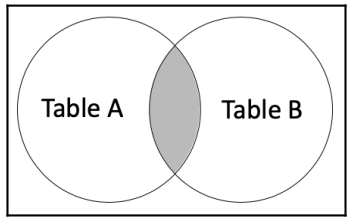
- Outer join
  - Left outer join: This type of join includes all rows from the left table and any matching rows between the left and right tables.
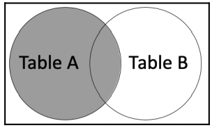
```sql
SELECT column(s)
FROM table1
LEFT OUTER JOIN table2
ON table1.column = table2.column
WHERE conditions
ORDER BY column(s);
```
  - Right outer join: This type of join includes all rows from the right table and any matching rows between the right and left tables.
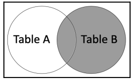
```sql
SELECT column(s)
FROM table1
RIGHT OUTER JOIN table2
ON table1.column = table2.column
WHERE conditions
ORDER BY column(s);
```
  - Full outer join: This type of join includes all rows from both the left and right tables. This type of join is not available in MySQL.
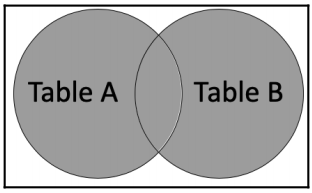

Advanced types of joins:
- Cross join: This type of join will return a combination of every row from two tables.
- Natural join:  This type of join will associate columns of the same name in the joined tables with each other. It's similar to an inner join or left outer join, but you don't specify the join columns.
- Self join: This type of join is used to join a table to itself.

## 5.2 Understand Union Join

A set is a collection of zero or more objects. Each object in a set is called an element. In MySQL, a table corresponds to a set, and a record corresponds with an element. You can get a subset from a set. A subset is a smaller set of elements from the set.

UNION allows you to combine two or more result sets into a single result set.

- The number of columns in the SELECT statements must be the same.
- The order of the columns in the SELECT statements must be the same.
- The data types of the columns must be the same or of a compatible type.
- The ORDERBY clause can only be used on the final SELECT statement.
- The names of the final columns are generated from the column names you use in the first SELECT statement.
- GROUP BY and HAVING clauses can only be used in each query, but can't be used to affect the final results.
- UNION: This removes duplicate rows without using DISTINCT in the SELECT statements.
- UNION ALL: This does not remove duplicate rows, and they will remain in the final result. This will perform faster than UNION because it doesn't have to remove duplicates.

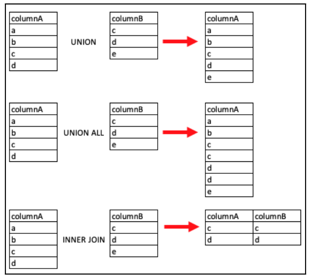

```sql
SELECT column(s)
FROM table1
WHERE conditions(s)
UNION/UNION ALL
SELECT column(s)
FROM table2
WHERE condition(s)
ORDER BY column(s);
```

## 5.3 Understand Intersect

An intersect allows you to combine two or more results sets that contain the distinct values of each set. MySQL doesn't support the INTERSECT SQL operator, but there is a workaround with a join. This can be done with DISTINCT and INNER JOIN.

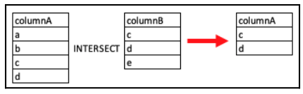

## 5.4 Understand Difference

To find the difference in MySQL, you can use the right excluding join or left excluding join, since MySQL doesn't support the EXCEPT or MINUS keywords.

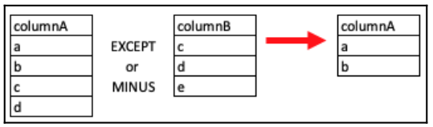

# 6 Modifying Data and Table Structures

## 6.1 Insert Data into Table

Single-row insert

```sql
insert into table_name (column_1, column_2, column_3)
values (value_1, value_2, value_3)
```

Multiple row insert

```sql
insert into table_name (column_1, column_2, column_3)
values (value_1, value_2, value_3)
(value_11, value_21, value_31)
(value_12, value_22, value_32)
```

Insert data from one table to another table

```sql
create table des_table
select * from src_table;
```

## 6.2 Delete Data from Table

You can delete all the records from a table, or use a WHERE clause to delete only some of the records from a table.

```sql
delete from some_table where some_condition;
```

## 6.3 Update Data in Table

```sql
update some_table 
set
field_1 = value_1,
field_2 = value_2,
field_3 = value_3
where some_condition;
```

## 6.4 Altering Table Structure

Adding a Column

```sql
ALTER TABLE table_name
ADD COLUMN column_2 SMALLINT NULL AFTER column_1;
```

Dropping a column

```sql
ALTER TABLE table_name
DROP COLUMN column_name;
```

Renaming a column (The below command is also possible to change data type and constraint of a column)

```sql
ALTER TABLE table_name
CHANGE COLUMN old_column new_column SMALLINT;
```

# 7 Transactions

A SQL transaction is a grouping of one or more changes to the database. Transactions help ensure a consistent state in your database. 

Four properties of transactions (ACID):
- Atomicity: This ensures all changes in a transaction are completed successfully. If they are successful, the changes are committed. If any change isn't successful, all the changes are rolled back.
- Consistency: This ensures any changes can't violate the database's integrity, including constraints. Changes interrupted by errors due to violations of database integrity are rolled back. 
- Isolation: All transactions are isolated from each other so that no other transaction can interfere with the other transactions that are running.
- Durability: Once a transaction is committed, any interruption to the database's availability, such as a restart or system failure, will not affect the consistency of the data.

States of a transaction:

- Starting a new transaction involves using the START TRANSACTION or BEGIN keywords. This signifies the beginning of the group of SQL queries that you want to run together. 
- Committing your changes involves making the changes permanent and uses the COMMIT keyword at the end of the transaction block.
- Rolling back your changes involves canceling the changes and uses the ROLLBACK keyword at the end of the transaction block.
- Auto-commit is enabled by default in MySQL, but you can disable it for a session with SET autocommit keywords. With auto-commit, you can't roll back changes, but if an error occurs, the changes are automatically rolled back. 

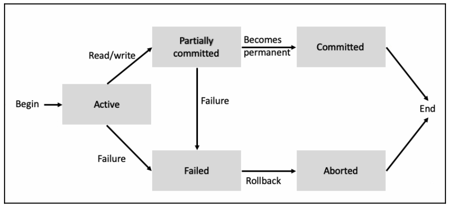

```sql
start transaction;
sql commands;
commit;
```

# 8 Grouping and Summarizing Data

The GROUP BY clause allows you to group rows that have the same values into summary rows. This clause is often used with aggregate functions.

```sql
SELECT column(s)
FROM table
WHERE condition(s)
GROUP BY columns(s)
ORDER BY column(s);
```

The HAVING clause is used to filter the GROUP BY results. The following code shows the HAVING syntax, where the WHERE and ORDER BY clauses are optional:

```sql
SELECT column(s)
FROM table
WHERE condition(s)
GROUP BY columns(s)
HAVING condition(s)
ORDER BY column(s);
```
Difference between HAVING and WHERE.

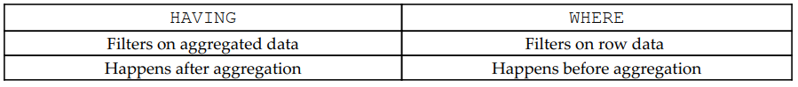

# 9 Advanced Querying Techniques

## 9.1 Sub-query

A subquery is a query nested in another query with parentheses. A subquery can be used in SELECT, FROM, INSERT, DELETE, UPDATE, and WHERE clauses, and can also be nested inside another subquery. The inner query is executed before the outer query so that the inner query results are passed to the outer query.

IN/ NOT IN

```sql
SELECT column(s)
FROM tablea
WHERE col1 IN (SELECT col
FROM tableb
WHERE condition(s));
```

ANY

```sql
SELECT column(s)
FROM tablea
WHERE col1 >= ANY (SELECT col
FROM tableb
WHERE condition(s));
```

ALL

```sql
SELECT column(s)
FROM tablea
WHERE col1 >= ALL (SELECT col
FROM tableb
WHERE condition(s));
```

EXISTS/ NOT EXISTS

```SQL
SELECT column(s) FROM table a
WHERE EXISTS (SELECT 1 FROM table b
WHERE a.col = b.col);
```


<, >, >=, <=, =, != are also available. Example:

```sql
SELECT column(s)
FROM tablea
WHERE col1 <= (SELECT col
FROM tableb
WHERE condition(s));
```

## 9.2 Common Table Expressions

A common table expression (CTE) is a container for a single SQL statement that will allow you to query a temporary result set. A CTE allows you to create complex queries in a more readable way.

The syntax for a single non-recursive CTE is as follows:

```sql
WITH ctename (col1, col2, colN)
AS (SELECT col1, col2, colN FROM table)
SELECT col1, col2, colN FROM ctename;
```

The syntax for a non-recursive CTE with multiple CTEs is as follows:

```sql
WITH ctename1 (col1, col2, colN)
AS (select col1, col2, colN from table1),
ctename2 (col1, col2, colN)
AS (select col1, col2, colN from table2)
SELECT col1, col2, colN
FROM ctename1
JOIN ctename2
ON ctename1.col1 = ctename2.col1;
```

# 10 Programmable Objects

## 10.1 Creating and Using View

A view is a stored query. You can select data from a view to return the results of the query. You can also think of a view as a virtual table. You can use view to:
- Hide sensitive data in some of the columns and you didn't want everyone to be able to view that data.
- Make column names more intuitive by using column aliases in the view definition
- Summarize data in a view to generate reports

```sql
CREATE VIEW nameofview AS
SELECT col1, col2, co1n
FROM tablename
WHERE condition;
```

## 10.2 Create and Using Stored Procedures

A stored procedure is a set of SQL statements stored in a database. It could be just one SQL statement or many statements. With the help of this, you can reuse certain pieces of code. 

This can particularly be helpful when you are grouping business logic into a set of queries that will need to be run over and over again.

```sql
DELIMITER $$
CREATE PROCEDURE storedprocname()
BEGIN
your sql statments go here;
END $$
DELIMITER ;

CALL storedprocname();
```

Flow control statements: 
- IF: Returns a value if the condition is TRUE and another value if it's FALSE. Use after SELECT, before FROM. 
```sql
IF(condition, value if true, value if false);
```
- CASE: Goes through conditions and then returns a value once the condition is met. This is like an expanded IF function (IF-THEN-ELSE). Use after SELECT, before FROM.
```sql
CASE
WHEN condition1 THEN result1
WHEN condition2 THEN result2
WHEN conditionN THEN resultN
ELSE result
END;
```
- LOOP: Executes a statement repeatedly. If you don't specifically terminate this, it can run infinitely.
```sql
[beginlabel:] LOOP
sql statements
END LOOP [endlabel];
```
beginlabel and endlabel are optional
- REPEAT: Repeats a statement until a condition is true. It always runs at least once.
```sql
[beginlabel:] REPEAT
sql statements
UNTIL condition
END REPEAT [endlabel]
```
- WHILE: Repeats a statement while a condition is true.
```sql
[beginlabel:]
WHILE condition DO
sql statements
END WHILE
[end_label]
```
- ITERATE: Starts the statement again. It can appear in LOOP, REPEAT, or WHILE statements.
- LEAVE: Exits the statement. It can appear in LOOP, REPEAT, or WHILE statements.
- RETURN: Used to return a value.

## 10.3 Trigger

A trigger is a set of actions that run after you insert, update, or delete data. Triggers are created on tables. You can use triggers to enforce business rules for data, audit data, or validate data.
- BEFORE INSERT: This causes the trigger to run some logic before you insert data into the table.
- AFTER INSERT: This causes the trigger to run some logic after you insert data into the table.
- BEFORE UPDATE: This causes the trigger to run some logic before you update data in the table.
- AFTER UPDATE: This causes the trigger to run some logic after you update data in the table.
- BEFORE DELETE: This causes the trigger to run some logic before you delete data from the table.
- AFTER DELETE: This causes the trigger to run some logic after you delete data from the table.

```sql
CREATE TRIGGER triggername
{BEFORE | AFTER} {INSERT | UPDATE| DELETE }
ON tablename FOR EACH ROW
triggerbody;
```

You can create multiple triggers on a table and have them precede or follow one another by adding the PRECEDES or FOLLOWS keywords to the trigger definition.

```sql
CREATE TRIGGER triggername
{BEFORE | AFTER} {INSERT | UPDATE| DELETE }
ON tablename FOR EACH ROW
{FOLLOWS | PRECEDES} anothertriggername
triggerbody;
```

